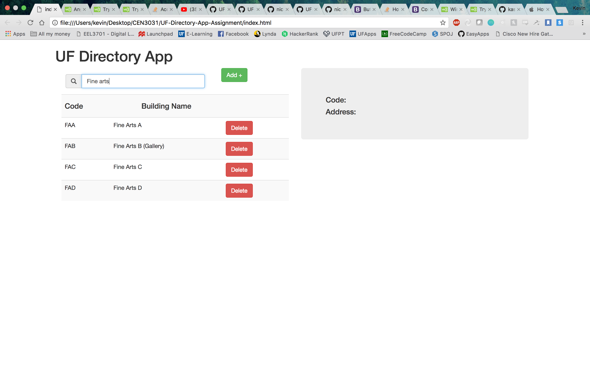
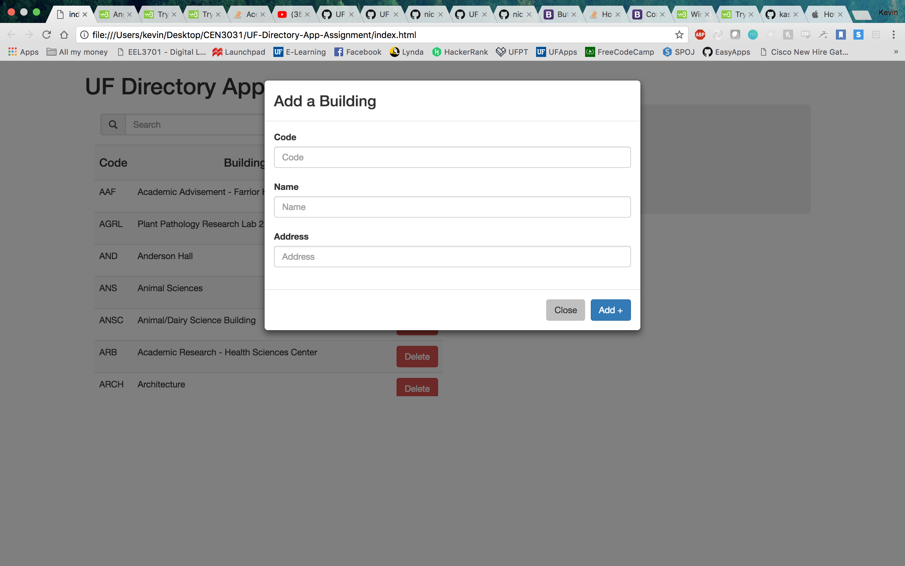
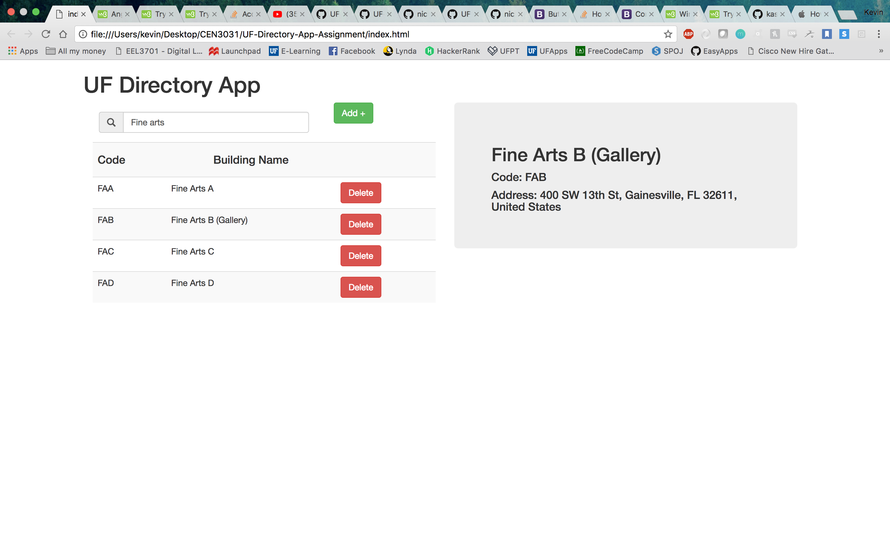

# Introduction to Front-end development with Angular.js
We will continue to build upon our directory application by creating a front-end interface with Angular.js to display listings, as well as the ability to add new listings and delete old ones.

#### Assignment Objectives
Your objective is to create the front-end of our UF Directory App that will display the listings and allow the user to add and delete old ones. 
To accomplish this you will:
- modify the **listingController.js** file to  display listings, as well as the ability to add new listings and delete old ones.
- 
### Tasks 
Take a look at the source code provided to you, and map out how the different files communicate with one another. You will notice there is a *factory*, a *controller*, and a *view* (provided by the index.html page). It is your responsibility to:

1. Complete the methods in the controller
2. Implement the prompts in the HTML view to make the application functional

# Instructions: 
1. Fork this repository and then navigate to it on your local machine's terminal 
2. Implement the tasks listed above
3. Check your that it works by looking at the index.html file in your favorit browser

#Website

