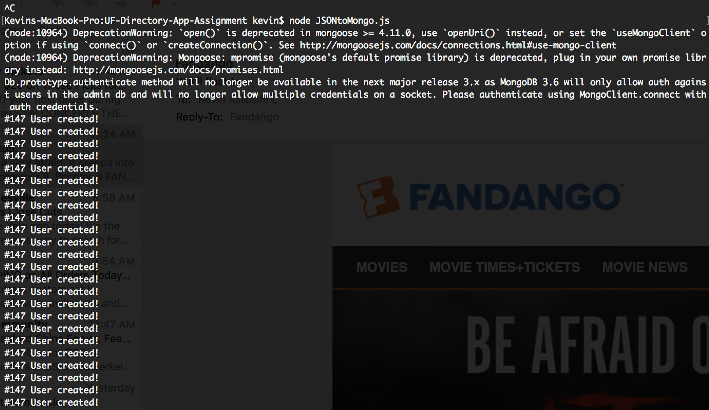
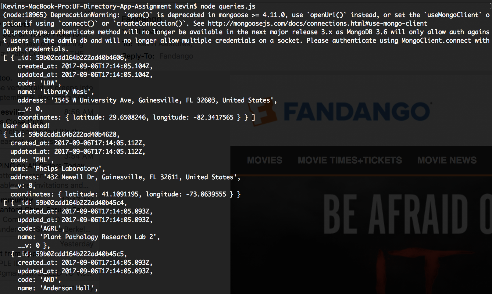

# Assignment 3: Persisting data using MongoDB and Mongoose

### Assignment
To port the listing data to MongoDB, you will be doing the following: 
- Defining a schema for the 'Listing' collection 
- Create a script that converts the JSON entries into Mongo documents and saves the documents to your database
- Retrieve/update/delete documents through database queries

Instructions:

1. Clone the repository
2. Define your schema in `ListingSchema.js`
3. Create a `config.js` file (based on `config.example.js`) and add the uri to your MongoLab database.
3. Ensure your schema passes the tests by running `mocha listing.model.test.js`
4. Fill out the `JSONtoMongo.js` script to add the listings to your database
5. Complete the functions in `queries.js`

# Database

